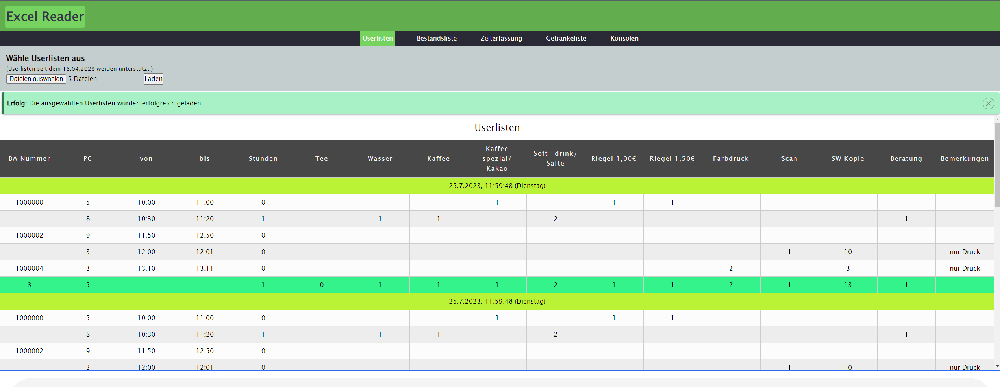
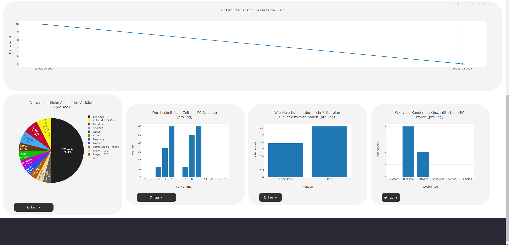
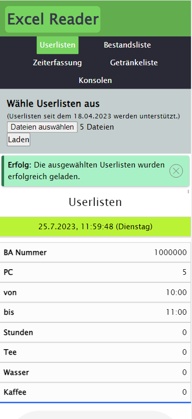
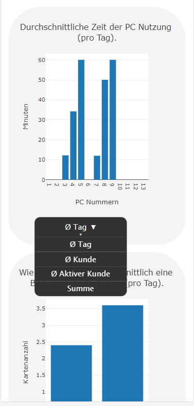

# ExcelReader
This project reads excel data used in the city library of Solingen and displays it with charts. For this XLSX and plotly are used as external libraries and everything is writen in typescript with HTML and CSS. Supported are all kinds of screens: from desktop to mobile phone screens. This project is currently under development and still has a long way to go. At the moment only userlists (a list of pc users) are read.
Important: No real data is used!

## Desktop view

 
 

## Mobile phone view
 

# What is done next?
- Format.json.ts needs some refactoring (and is not used properly)
- More charts for userlists
- Getting started with a new excel file - probably "inventory list".